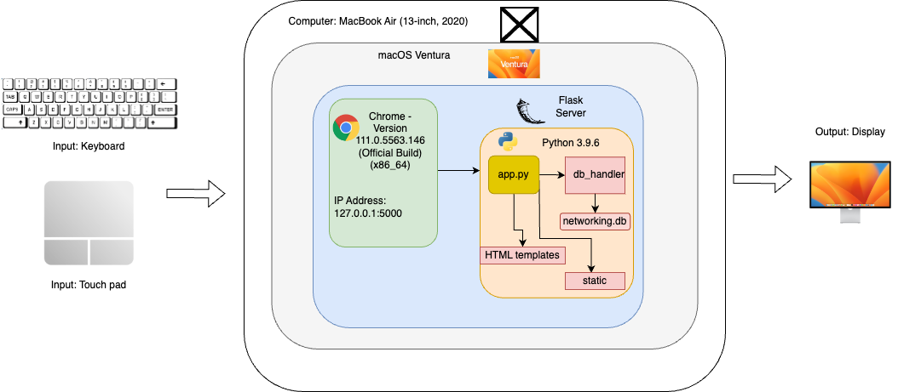
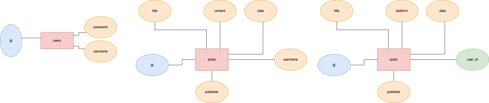
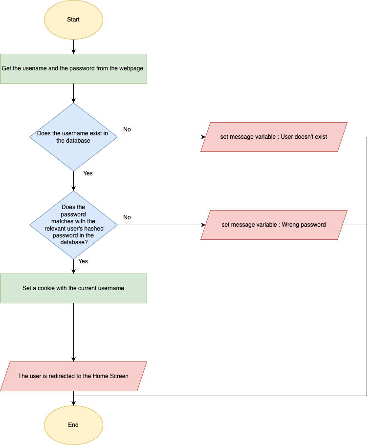
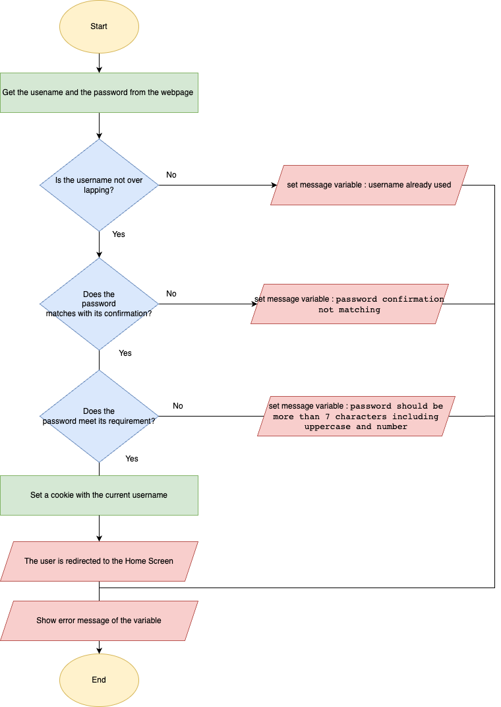
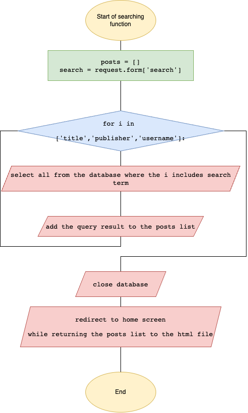
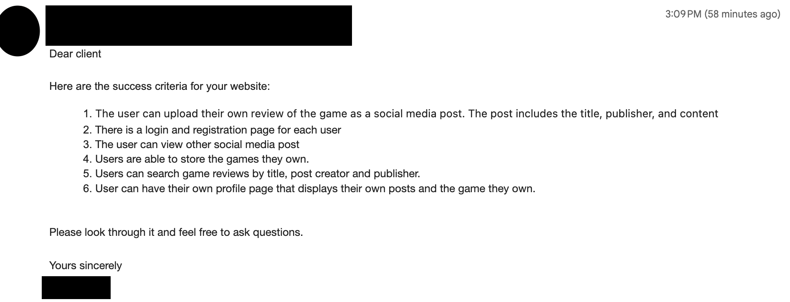
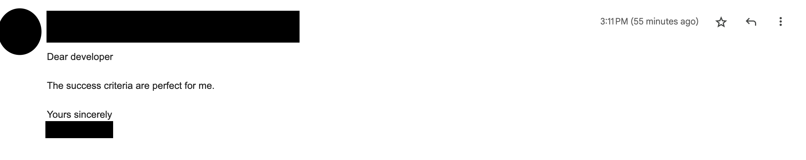
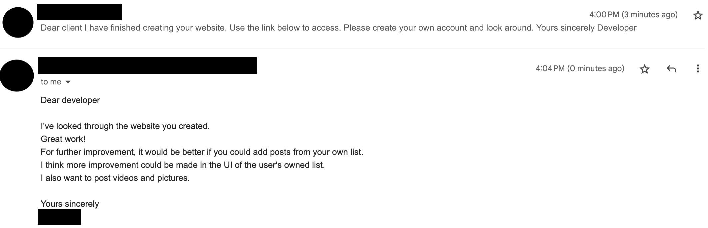

# Unit 4 Project: Game review app


## Criteria A: Planning

## Problem definition(Client identification)
My client(myself) is a student and a huge game enthusiast. I find it very challenging to determine whether the quality of a game is worth purchasing or not.

When I want to purchase a new game, I often struggle to find reliable and informative reviews, since fans mostly make the sources and those could be biased.
Sometimes it is very hard just to look for information on a specific game because it comes with many other unneeded information.

Also, the information for different games are made by different individuals on various platforms.
Therefore it makes it very hard to compare reviews of different games with each other.
We also don’t have a specific platform to share our opinion about games.

These problems come up because there is no service that brings a great number and variety of gamers into one and shares their opinion.
The lack of information and comparison will make it difficult to determine the value and quality of the game.
Knowing your own gaming experience also helps you to make good purchase decisions. Currently there are no good platforms for you to look back at what games you have and what kind of opinions you had on them.

These issues can result in a poor gaming experience, such as missing opportunities to play better games and wasting money on games.


## Proposed Solution
To tackle the problem defined above, we propose to create a social media-style website that brings together a community of gamers to share their, reviews, and experiences with different games. The website will be built using Python as it is secure, open-source, and extensive, making it a better alternative to Javascript, which poses security risks.[^3] Flask will be used to host the website as it is highly scalable and provides great control over the code.[^4] To store the data, we will use SQLite as it excels at small to medium HTTP requests and can run independently after installation.[^5] The website's user interface will be created using HTML and CSS, which allows to create the structure and design in detail.[^6][^7] This website will give gamers access to a reliable and comprehensive source of information. These can help us make informed decisions and enhance their overall gaming experience.


[^3]:Ijaz, Arslan. “JavaScript Vs. Python: Which One is Better? | by Arslan Ijaz | CodeX.” Medium, 20 September 2022, https://medium.com/codex/javascript-vs-python-which-one-is-better-b873f4e69583. Accessed 19 May 2023.

[^4]:Shah, Hardik. “6 Reasons Why Flask is Better Framework for Web Application Development.” Able, 1 December 2021, https://able.bio/hardikshah/6-reasons-why-flask-is-better-framework-for-web-application-development--cd398f73. Accessed 19 May 2023.

[^5]:SQL is 43 years old - here's 8 reasons we still use it today.” Blog, 28 April 2017, https://blog.sqlizer.io/posts/sql-43/. Accessed 19 May 2023.

[^6]:Goyal, Yashi. “Advantages of HTML | Top 10 Amazing Advantages of HTML.” eduCBA, https://www.educba.com/advantages-of-html/. Accessed 19 May 2023.

[^7]:“What Is CSS and Why Should You Use It?” Devmountain, https://devmountain.com/blog/what-is-css-and-why-use-it/. Accessed 19 May 2023.


## Success Criteria
| No. | Success critieria	         | Issue tackled       |
|----------------------------|---------------------------------|----------------|
| 1 | The user can upload their own review towards the game as a social media post. The post includes the title, publisher and content  | "We also don’t have a specific platform to share our opinion about games."  | 
| 2 | There is a login and registration page for each user | "These problems come up because there is no service that brings a great number and variety of gamers into one and shares their opinion." (Making a login and register system will allow the platform to have a number of users.) | 
| 3 | The user can view other social media post  | "I often struggle to find reliable and informative reviews", "Therefore it makes it very hard to compare reviews of different games with each other."  | 
| 4 | Users are able to store the games they own.  | "there are no good platforms for you to look back at what games you have" | 
| 5 | Users can search game reviews by title, post creator and publisher.  | "Sometimes it is very hard just to look for information on a specific game because it comes with many other unneeded information."  | 
| 6 | User can have their own profile page that displays their own posts and the game they own. | "Currently there are no good platforms for you to look back at what games you have and what kind of opinions you had on them." | 


# Criteria B: Design

## System Diagram

## Data Storage

## UML Diagram

## Wireframe


## Record of Tasks
| Task No  | Planned Action  | Planned Outcome | Time estimate  | Target completion date  | Criterion |
|:----------|:-------------------------|:----------|:----------|:----------|:----------|
| 1  | Planning: Writing the problem definition | Record the problem definition in the repository | 30 mins  | 2023.05.10    | A   |
| 2  | Planning: Write down the success criteria | record the success criteria and how it is refering the problem definition  | 30 mins  | 2023.05.10    | A  |
| 3  | Design: Create a prototype wireframe and ER diagram |  Get a specific idea of what the website will be looking like   | 30 mins  | 2023.05.10    | B |
| 4  | Development: Coding the login and register page |  Get a specific design for the login page   | 30 mins  | 2023.05.10    | C |
| 5  | Development: Create database in SQL |  Create all database needed in the website   | 30 mins  | 2023.05.10    | C |
| 6  | Development: Create the function for login and register |  Get a functional register and login page connected with the database   | 30 mins  | 2023.05.10    | C |
| 7  | Development: Coding the Home Screen |  Get a specific design for the Home screen   | 30 mins  | 2023.05.10    | C |
| 8  | Development: Create the side bar which is common through the website |  Get a specific design and function for the side bar   | 30 mins  | 2023.05.10    | C |
| 9  | Development: Create the function for Home Screen |  Get a functional Home Screen where you can See others post   | 30 mins  | 2023.05.10    | C |
| 10  | Development: Coding the Share Screen |  Get a specific design for the Share page   | 30 mins  | 2023.05.10    | C 
| 11 | Development: Create the function for Share Screen |  Get a specific design for the Share page where you can create posts   | 30 mins  | 2023.05.10    | C |
| 12 | Development: Coding the Share Screen |  Get a specific design for the Share page   | 45 mins  | 2023.05.10    | C 
| 13 | Development: Create the function for Share Screen |  Get a specific design for the Share page where you can create posts   | 30 mins  | 2023.05.10    | C |
| 14 | Development: Coding the Add Screen |  Get a specific design for the Add page   | 45 mins  | 2023.05.11    | C 
| 15 | Development: Create the function for Add Screen |  Get a specific design for the Add page where you can add games to your owned list.   | 30 mins  | 2023.05.11    | C |
| 16 | Development: Coding the Profile Screen |  Get a specific design for the Profile page   | 30 mins  | 2023.05.11    | C 
| 17 | Development: Create the function for Profile Screen |  Get a specific design for the Add page where you can see what game you own and posts you created.   | 30 mins  | 2023.05.11    | C |
| 18 | Development: Create the searching function |  Create a search bar and make it functionable.  | 30 mins  | 2023.05.11    | C |
| 19 | Development: Finish all theCSS |  Finish the design of the UI  | 30 mins  | 2023.05.11    | C |
| 20 | Design: Complete the UML diagram |  Show relation of classes  | 30 mins  | 2023.05.11    | B |
| 21 | Design: Complete the flow diagram |  Create three flow charts  | 60 mins  | 2023.05.11    | B |
| 22 | Design: Complete the ER diagram |  Show relation between databases  | 30 mins  | 2023.05.12    | B |
| 23 | Design: Complete the wireframe |  Show relations between each screens and how it works  | 30 mins  | 2023.05.12    | B |
| 24 | Evaluate: Get feedback from client |  Gather feedback from a none client person which is a new perspective  | 10 mins  | 2023.05.12   | B |
| 25 | Evaluate: Get feedback from other users(besides client) |  Gather feedback from a none client person which is a new perspective  | 15 mins  | 2023.05.12    | B |


## Flow Diagrams
### login function


### register function


### search function

## Test Plan
| Instruction                        | Category     | Input example / code                               | Description                                                                                                        | Expected output                                                         | Success criteria |
|------------------------------------|--------------|----------------------------------------------------|--------------------------------------------------------------------------------------------------------------------|-------------------------------------------------------------------------|------------------|
|Test the login   | Unit testing  | Email: banana password: banana  | The user is able to login to the application and the home screen is displayed when they enter | The user logs in if the username and password is correct and the home screen is displayed with a cookie being created as well(The password is for testing)   |2, 3 | 
|Test the login with wrong password | Unit testing  | username: banana Password: melon (wrong password) | The user inputs the wrong password when trying to login | Error message shows the password is wrong | 2  | 
|Test the login with wrong username | Unit testing  | username: melon(does not exist) Password: banana | The user inputs the wrong username | Error message shows the user does not exist | 2  | 
|Test the registration | Unit testing | username: banana password: Melon123 check password: Melon123  | The user inputs their email and passwords and try to sign up | The user is able to sign up and their email and password (which is hashed) is saved in the database 
|Test the registration with wrong inputs | Unit testing | username: bananapass password: abc check password: abc | The user doesnt input the password that reaches the requirement. | An error message is displayed on the user interface 	| 2  | 
|Test the registration with unmatching confirmation | Unit testing | username: bananaconfirm password: Melon123 check password: Banana123 | The user doesnt input matching confirm passport. | An error message is displayed on the user interface 	| 2  | 
|Test the login, registeration, home screen, new posts and profile page  | Integration testing   | uswername: banana Password: Melon123  Check password: Melon123  title: MHXX publisher: Capcom content: Very good | The user is able to signup and then login, letting them go to the home screen where they are able to view everyone's posts and then they are able upload new posts | They are able to signup and login and create a new post that is displayed in the home screen and profile page  | 1, 2, 3, 6 |
|Test the adding function	|Unit testing 	| n/a	| This enables the user to add the games they own to their own list. | The information will be added in the database and user can check them in their profile page.	| 4  | 
| Test the search function  | Unit testing  | Word searched in search bar MHXX   | The user inputs a search word in the search bar which searches the database   | The posts with including the search term is outputted in the home page |  5 |  
|Test the profile page | Unit testing | n/a  | The user clicks the profile button in the sidebar 	| The user is able to see the games they own and the posts that they have posted in the past 	| 6  | 


# Criteria C: Development

## Existing Tools
| Software/Development Tools | Coding Structure Tools          | Libraries      |
|----------------------------|---------------------------------|----------------|
| PyCharm                    | Encryption                      | Flask          |
| Relational databases       | Objects, attributes and methods | sqlite3        |
| SQLite                     | If statements                   | passlib        |
| Python                     |                                 |                |
| Chat GPT                   |                                 |                | 
## List of techniques used

1. Flask library/routes
2. For loops
3. If statements
4. Password hashing
5. Interacting with databases
6. Lists
7. Cookies

## Success criteria
### 1 The user can upload their own review towards the game as a social media post. The post includes the title, publisher and content.

The client requested a function to post game reviews. As a solution I created this function which allows the user to create a public post.  This function works by collecting the post information(title,publisher,content) from the html file and adding them to the posts database.

This code bellow is a function to add the post information to the database. First, it gets the post information from the html file. Then it will run the query to add the information to the database. This operation could be done in the share screen
```.py
def share():
    print(f'share,: method: {request.method}')
    if request.method == "POST":
        title = request.form['title']
        publisher = request.form['publisher']
        content = request.form['content']
        now = datetime.datetime.now()
        username = request.cookies.get('username')
        db = database_handler('game.db')
        query = f'INSERT INTO posts(title,publisher,username,content,date) values ("{title}","{publisher}","{username}","{content}","{now}")'
        db.run_query(query)
        print('post success')
        db.close()
        response = make_response(redirect('/home'))
        return response
    return render_template('share.html')
```
This code bellow is for creating the database.It runs every time the app is runned and it creates the database when it doesnt exist.
```,py
query_post = """CREATE table if not exists posts (
        id INTEGER PRIMARY KEY,
        title TEXT,
        publisher TEXT,
        username TEXT,
        content TEXT,
        date TEXT
    )
    """
db.run_save(query_post)
```
### 2 There is a login and registration page for each user.
The client requested a login and register function. As a solution for this I created a register and login function which the informations are hashed and protected. The login funtion works by matching the userinput(username, password) with the information in the database. The register function works by adding the userinput(username, password) into the database after the innput validation.

The code bellow is the login function. First it receives user input(username, password) from the html file. After that the query will search for the matching username in the database. If the user didn't exist it will show a error message that says "User doesnt exist". When the user existed, it will check if the password matches the one in the database. If it didn't match it will show a message that saya "Wrong password". When the password match, the user will be redirected to the home page.
```.py
def login():
    msg = ""
    if request.method == "POST":
        username = request.form['username']
        passwd = request.form['password']
        passwd = hash(passwd)
        db = database_handler("game.db")
        user = db.search(f"Select * from users where username = '{username}'")  # Check the user in the database
        print(user)
        print(username)
        print(passwd)

        if len(user)>0:
            print(user[0][1])
            if passwd == user[0][2]:
                db.close()

                response = make_response(redirect('/home'))
                response.set_cookie('username', username)
                return response
            else:
                msg = 'Wrong password'
                print(msg)
        else:
            msg = "User doesn't exist"
            print(msg)
    return render_template("login.html", message=msg)
```
The code bellow is the register function. First it receives user input(username, password, password confirmation) from the html file. After that the query will search for the overlapping username in the database. If the user already exists it will show a error message that says "username already used". When the username didn't overlap, it will check if the password matches the requirement. The password validation function is pulled from the my_lib.py file:
```.py

def password_require(password):
    print('start')
    password = str(password)
    number = False
    upper = False
    length = False
    for i in password:
        if i.isdigit():
            number = True
        if i.isupper():
            upper = True
    if len(password) > 7:
        length = True
    print(number,upper,length)
    if number == False or upper == False or length == False:
        return 'invalid'
```
This check if the password includes atleast an uppercase character, integer and is more than 7 characaters. If the password didn't match the requirement it will show error message:"password should be more than 7 characters including uppercase and number". When the password met the requirement, it will check if the password is confirmed. If the password did not match the confirmation it will show an error message: "password confirmation not matching". Once all the requirements are met and confirmed the information(username, password) will be added in the database. After this the user will be redirected to the home page.


```.py
def register():
    print(request.method)
    if request.method == 'POST':
        db = database_handler("game.db")
        username = request.form['username']
        password = request.form['password']
        con_pass = request.form['con_password']

        print(username, password,con_pass)
        query = f"SELECT username from users where username = '{username}'"
        user = db.search(query)
        msg = ''
        if len(user) > 0:
            msg = 'username already used'
            print(msg)
        elif password_require(password) == 'invalid':
            msg = 'password should be more than 7 characters including uppercase and number'
            print(msg)

        elif password != con_pass:
            msg = 'password confirmation not matching'
            print(msg)
        else:
            query = f'INSERT INTO users(username,password) values ("{username}","{hash(password)}")'
            db.run_query(query)
            db.close()
            response = make_response(redirect('/home'))
            print('success')
            response.set_cookie('username',username)
            return response
    return render_template('register.html')
```
For both functions, once the user is directed to the home page, a cookie of the username will be set.

### 3 The user can view other social media post.
The client requested to see other peoples post. As a solution I made the home screen to show all post. In this function the function will get information of all posts from the database. The information will be sent to the html and will be displayed.

python code
```.py
def home():
    current_user = request.cookies.get('username')
    print(f'current user: {current_user}')
    db = database_handler("game.db")
    query = f"SELECT * from posts"
    posts = db.search(query)
    print(posts)
    return render_template('home.html',posts = posts)
```
In the python code the query gets all information for every post. The information will sent to the html file.

html code
```.py

    <style>
        .post {
            width: 200px;
            height: 200px;
            background-color: #f2f2f2;
            border: 1px solid #ccc;
            padding: 10px;
        }
    </style>

    <div class="post">
        <p class="title">{{ item[1] }}</p>
        <p class="publisher">{{ item[2] }}</p>
        <p class="creator">{{ item[3] }}</p>
        <p class="content">{{ item[4] }}</p>
        <p class="date">{{ item[5] }}</p>
        </div>
    </div>


```
In the html code they will first create a post based on the information recieved. Then it will loop all the process for every post using a for loop.

### 4 Users are able to store the games they own.
The client requested to have a function to create a list for each user to add games that they own. As a solution I added a function that could store owned games in a database. The function will recieve user input from the html file. The information will be added to the owned table. After the addition the user will be redirected to the home page.
```.py
def add()
    if request.method == 'POST':
        print('step1')
        db = database_handler("game.db")
        user = request.cookies.get('username')
        user_id = db.search(f"Select id from users where username = '{user}'")
        user_id = user_id[0][0]
        print('step2')
        print(f'add: {user}{user_id}')
        title = request.form['title']
        publisher = request.form['publisher']
        platform = request.form['platform']
        print('step3')
        now = datetime.datetime.now()

        query = f'INSERT INTO owned(title,publisher,platform,user_id,date) values ("{title}","{publisher}","{platform}","{user_id}","{now}")'
        print('run successss')
        db.run_query(query)
        db.close()
        response = make_response(redirect('/home'))
        return response
    return render_template('add.html')
```
### 5 Users can search game reviews by title, post creator and publisher.
The user requested a function that could search posts. As a solution, I created a function that could search post from its title, publisher or username. The function works by colecting user input from the html file and than search the term from the database.
The term will be searched through the database for 3 times which is from the title, publisher and username.
```.py
    if request.method == 'POST':
        posts = []
        search = request.form['search']
        print(search)
        for i in ['title','publisher','username']:
            query = f"SELECT * from posts where {i} LIKE '%{search}%'"
            post = db.search(query)
            print(post)
            posts += post

        db.close()
        return render_template('home.html', posts=posts)
```

### 6 User can have their own profile page that displays their own posts and the games they own.
The user wanted to be able to see their own posts and the games they own in the home screen. As a solution I created the home screen to be able to display the users game and past posts.
```.py
def profile():

    db = database_handler("game.db")
    user = request.cookies.get('username')
    user_id = db.search(f"Select id from users where username = '{user}'")
    user_id = user_id[0][0]
    print(user_id)
    owned = db.search(f"Select * from owned where user_id = '{user_id}'")
    post_self = db.search(f"Select * from posts where username = '{user}'")
    print(owned)
    print(post_self)

    db.close()
    return render_template('profile.html',owned = owned, post_self = post_self)
```
## Computational thinking
### Algorithmic thinking
I applied algorithmic thinking to create the register function. I aproached the whole process of input validations by creating a step by step function for each requirement.  
```.py
if len(user) > 0:
            msg = 'username already used'
            print(msg)
        elif password_require(password) == 'invalid':
            msg = 'password should be more than 7 characters including uppercase and number'
            print(msg)

        elif password != con_pass:
            msg = 'password confirmation not matching'
            print(msg)
        else:
            query = f'INSERT INTO users(username,password) values ("{username}","{hash(password)}")'
            db.run_query(query)
            db.close()
            response = make_response(redirect('/home'))
            print('success')
            response.set_cookie('username',username)
            return response
```
### Pattern recognition
I applied pattern recognition to create a sidebar. Since I had a common code for the side bar in every htmlfile(besides login and register) I made a CSS code that could be applied to all of them.
```.py
.common .sidebar {
  background-color: #f1f1f1;
  padding: 10px;
  margin-top: 10px;
  border-radius: 5px;
  position: fixed;
  left: 0;
  top: 0;
  bottom: 0;
  width: 200px;
  font-family: "Arial Black";

}

.sidebar ul {
    list-style-type: none;
    padding: 0;
    margin: 0;
}

.sidebar li {
    margin-bottom: 5px;
}

.sidebar a {
    display: block;
    padding: 10px;
    color: #333;
    text-decoration: none;
    border-radius: 3px;
}

.sidebar a:hover {
    background-color: #ddd;
}
```
### Abstracttion
I applied abstraction by trying to use common variables. For example although there are two ways to identify the user from the database, which is the username and id. I chosed to use the username since it could be used in wider range and make the coding easy. Appling this knowledge allowed me to not use unneeded variables.

### Decomposition
I applied decomposition by tackling each success criteria individualy and putting it together afterwards. It made me easier to find the solution of error since individual functions makes it easier to identify the error happening.


## Problem encountered
The biggest problem I encountered through out this project is to manage the connection between HTML and CSS. To conquer this issue I tried to make groups of related elements in HTML so that it is easier to identify each part in CSS.

# Criteria D: Functionality

## Demonstration Video
https://drive.google.com/drive/folders/1pg5xNzdxO-X2V1teS585dOvp-tb3qcZz?usp=share_link

# Critieria E: Evaluation

## Evaluation table

### Client (Record of this is in the appendix) 
| Critieria | Met or not?        | Feedback       |
|----------------------------|---------------------------------|----------------|
|1. The user can upload their own review towards the game as a social media post. The post includes the title, publisher and content  |Met      |Met, no suggestions	|
|2. There is a login and registration page for each user  | 	Met	| Met, no suggestions		| 
|3. The user can view other social media post  | Met		| Better if you could add photos or videos of gameplay  | 
|4. Users are able to store the games they own.  | Met		| It would be great if you could make a post from your own list| 
|5. Users can search game reviews by title, post creator and publisher.  | Met		|no suggestions			| 
|6. User can have their own profile page that displays their own posts and the game they own.  | Met			| Make the user owned list look better.	| 

### Other user (Record of this is in the appendix) 

| Critieria | Met or not?        | Feedback       |
|----------------------------|---------------------------------|----------------|
|1. The user can upload their own review towards the game as a social media post. The post includes the title, publisher and content  |Met      |Met, no suggestions	|
|2. There is a login and registration page for each user  | 	Met	| Met, no suggestions		| 
|3. The user can view other social media post  | Met		| Better if you could see the other users profile.  | 
|4. Users are able to store the games they own.  | Met		| Mabye make a wish list.| 
|5. Users can search game reviews by title, post creator and publisher.  | Met		|no suggestions			| 
|6. User can have their own profile page that displays their own posts and the game they own.  | Met			| no suggestion	| 

This was after I showed this to my online gaming friend.

## Suggestions for future development

### Post from your own list
The first suggestion was to make it able to create a post from your own list. This could be done by adding a function in the profile page which will redirect to the sharing screen with the selected information(such as title and publisher).

### Images 

The second suggestion was to make it able to share photos and videos in the post. This would be useful since users will be able to give more detail on what they are mentioning in the post. For example if the user is talking about a bug in the gamr they can actualy show the video of it.


# Appendix

## Client interview (planning and design) 


*Client and the Developer agreeing to the success criteria*
## Client interview (Feedback) 

*Developer collecting feedback from client*

